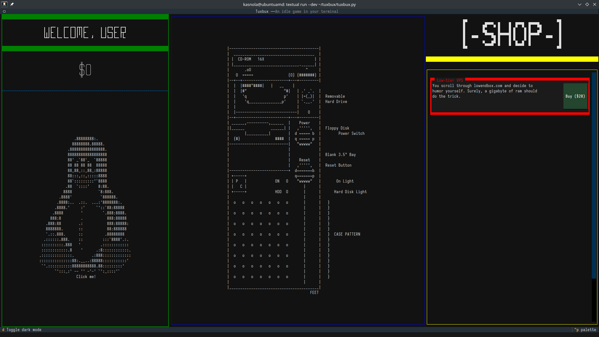

# tuxbux

An idle game for the terminal, made with Textual

# How to install

Do `pip install textual`, or `pipx install textual`

Tested on Python 3.12.3, Textual 2.12. Those should be the only dependencies + your favorite terminal emulator!

**Untested on Windows!** The save & load mechanic _should_ work, though.

# How to play

`textual run tuxbux.py`

# Credits

Josia @ [Hack Club](https://hackclub.com/) for running the [terminalcraft](https://github.com/hackclub/terminalcraft) YSWS

[asciiart.eu](https://www.asciiart.eu/computers/computers) for the computer ASCII art

Mik @ [ascii-art.de](http://www.ascii-art.de/ascii/jkl/linux.txt) for the Tux ASCII art
